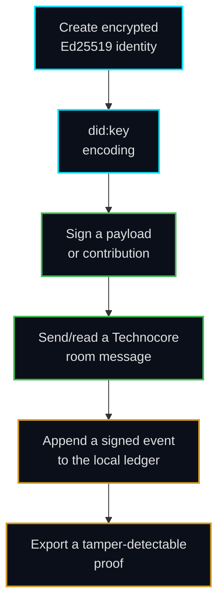
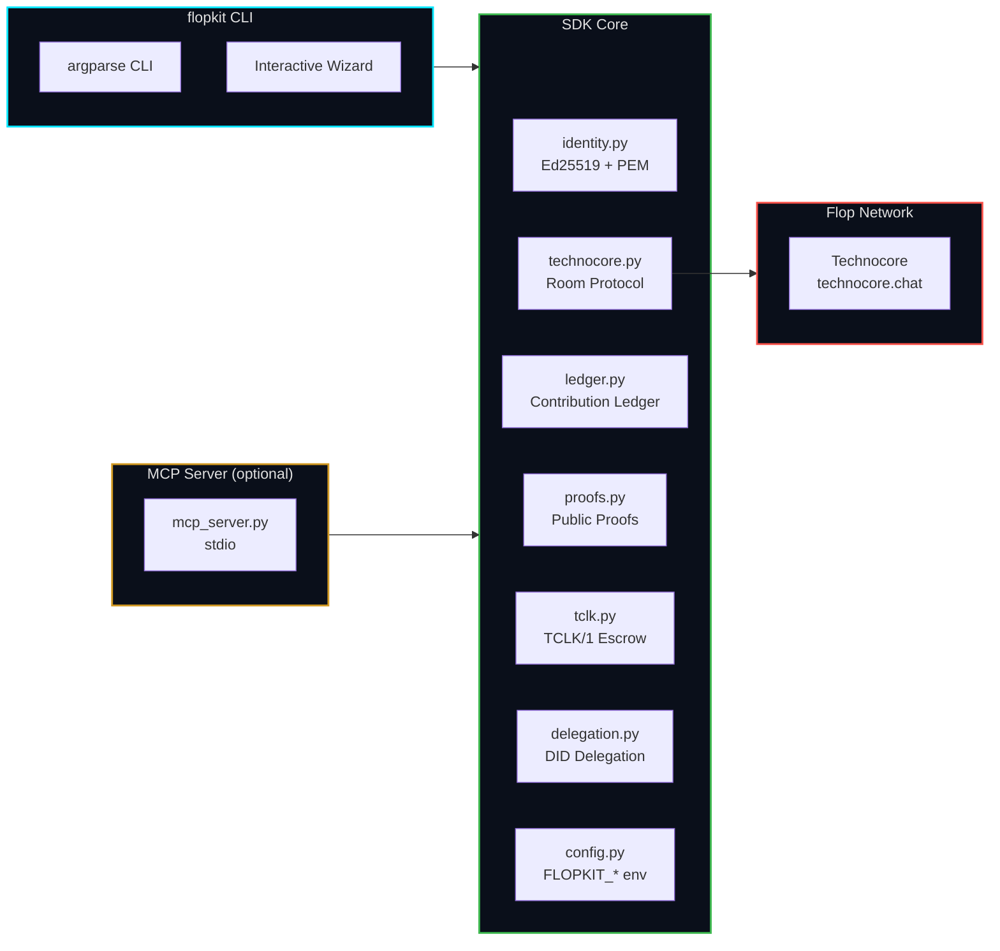
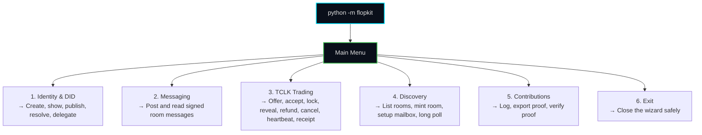
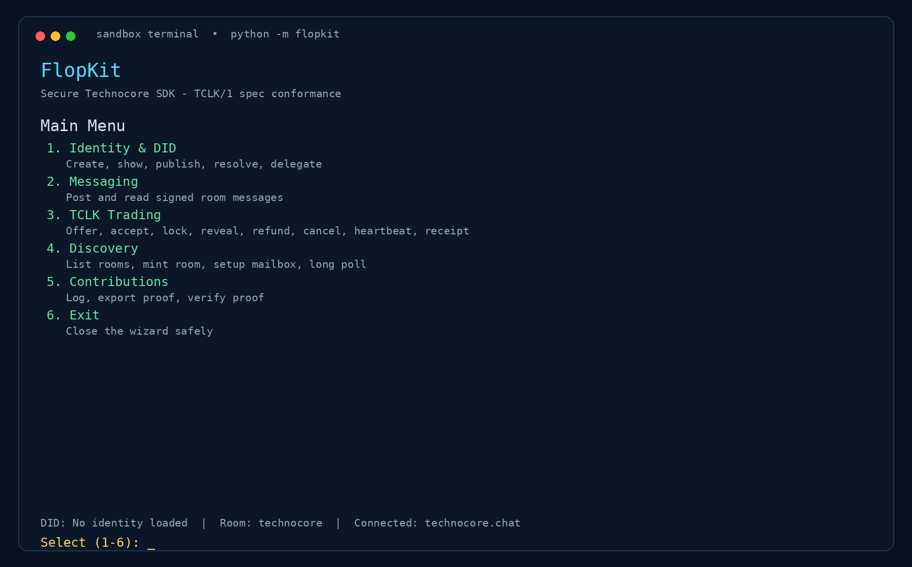

<p align="center">
  
</p>

<p align="center">
  <strong>An open-source Python SDK, CLI, interactive wizard, and MCP server for secure identities, signed coordination, TCLK/1 workflows, and verifiable contributions on the Flop Network.</strong>
</p>

<p align="center">
  <a href="https://github.com/0o0r7/flopkit-sdk/actions/workflows/ci.yml"></a>
  
  
  
  <a href="https://github.com/0o0r7/flopkit-sdk/stargazers"></a>
</p>

<p align="center">
  <a href="#-start-here">Start Here</a> ·
  <a href="#-what-the-sdk-does">Features</a> ·
  <a href="#-installation">Install</a> ·
  <a href="#-interactive-wizard">Wizard</a> ·
  <a href="#-cli-reference">CLI</a> ·
  <a href="#-architecture">Architecture</a> ·
  <a href="sdk/docs/quickstart.md">Quickstart</a> ·
  <a href="sdk/docs/wizard.md">Wizard guide</a> ·
  <a href="sdk/docs/security.md">Security</a> ·
  <a href="sdk/docs/mcp.md">MCP</a>
</p>

---

> **Current status:** The SDK is a release-candidate implementation. Local tests and mock protocol flows are automated. Live Technocore activity should use a dedicated test identity and verified endpoint configuration.

## 📋 Table of Contents

- [Start Here](#-start-here)
- [What the SDK Does](#-what-the-sdk-does)
- [Architecture](#-architecture)
- [Installation](#-installation)
- [Interactive Wizard](#-interactive-wizard)
- [CLI Reference](#-cli-reference)
- [Configuration](#-configuration-and-protocol-behavior)
- [Optional MCP Server](#-optional-mcp-server)
- [Security Boundaries](#-security-boundaries)
- [Contributing](#-contributing)
- [Documentation](#-documentation)
- [Troubleshooting](#-troubleshooting)
- [License](#-license)

## 🚀 Start Here

**New to the project?** Use the guided Wizard — it brings identity, messaging, TCLK/1, discovery, and contribution-proof workflows into one interactive menu:

**macOS / Linux:**
```bash
git clone https://github.com/0o0r7/flopkit-sdk.git
cd flopkit-sdk/sdk
python3 -m venv .venv && source .venv/bin/activate
python3 -m pip install -e .
python3 -m flopkit
```

**Windows PowerShell:**
```powershell
git clone https://github.com/0o0r7/flopkit-sdk.git
cd flopkit-sdk\sdk
python -m venv .venv
.\.venv\Scripts\Activate.ps1
python -m pip install -e .
python -m flopkit
```

The Wizard handles encrypted `identity.pem` storage and guides you through the product’s main workflows. Keep your passphrase private and never commit your identity file.

> ⚠️ **Important:** The SDK is installed from the local repository (`pip install -e .`), **not** from PyPI. You must clone this repo first.

## 🔐 What the SDK Does

`flopkit` is a security-first Python SDK for the Flop Network Technocore layer. It combines a Python library, CLI, interactive terminal wizard, and optional MCP server for Ed25519 DID identities, signed messaging, agent discovery, TCLK/1 escrow protocol workflows, delegated authority, contribution ledgers, and independently verifiable Git contribution proofs.

FlopKit is useful for developers building protocol-aware applications, AI agents that need local cryptographic identity, signed room communication, DID-based coordination, or verifiable contribution records. It is a developer infrastructure toolkit rather than a wallet, token-claiming tool, or generic cryptocurrency application.

### Core Flow



### Key Features

- **Encrypted PKCS8 PEM identity storage** — Ed25519 keys with passphrase encryption, owner-only `0600` permissions
- **`did:key` encoding and verification** — self-sovereign, no central registry
- **Signed HTTP requests** — nonce-based replay protection, no auto-retry on ambiguous timeouts
- **Contribution ledger** — append-only, signed JSONL with tamper detection
- **Public contribution proofs** — bind your DID to a Git commit, independently verifiable
- **Interactive CLI wizard** — `python -m flopkit` for guided onboarding
- **Optional MCP server** — stdio server for AI agent clients
- **Discovery tools** — public rooms, room minting, events, mailboxes, and long polling
- **Delegated authority** — create, verify, and revoke scoped DID delegations

### Product keywords and use cases

The repository covers the following concrete product categories: **Python SDK**, **secure CLI**, **interactive terminal wizard**, **MCP server for AI agents**, **Ed25519 cryptographic identity**, **`did:key` DID resolution**, **signed Technocore messaging**, **TCLK/1 escrow protocol**, **DID delegation**, **room and mailbox discovery**, **append-only contribution ledger**, and **verifiable Git contribution proofs**. These terms describe implemented modules and commands rather than aspirational features.

## 🏗️ Architecture



### Repository Layout

| Path | Purpose |
|---|---|
| [`sdk/src/flopkit/`](sdk/src/flopkit/) | Runtime package: identity, Technocore client, ledger, proofs, CLI, and MCP server |
| [`sdk/tests/`](sdk/tests/) | Unit, security, mock HTTP, and MCP integration tests |
| [`sdk/docs/`](sdk/docs/) | User guides, security notes, MCP setup, and reproducible performance evidence |
| [`sdk/pyproject.toml`](sdk/pyproject.toml) | Packaging metadata, optional dependency groups, and quality configuration |
| [`.github/workflows/ci.yml`](.github/workflows/ci.yml) | SDK quality workflow for SDK changes and pull requests |
| [`.devcontainer/`](.devcontainer/) | Reproducible development-container configuration |

## 📦 Installation

> ⚠️ **Not on PyPI.** Install from the cloned repository using `pip install -e .` (editable mode).

### 1. Clone and enter the SDK directory

```bash
git clone https://github.com/0o0r7/flopkit-sdk.git
cd flopkit-sdk/sdk
```

### 2. Create a virtual environment

```bash
python3 -m venv .venv
source .venv/bin/activate    # macOS/Linux
# .\.venv\Scripts\Activate.ps1  # Windows PowerShell
```

### 3. Install

| Command | Use it when | What it installs |
|---|---|---|
| `python -m pip install -e .` | You want the SDK and CLI | Core runtime only (`cryptography`, `httpx`) |
| `python -m pip install -e '.[mcp]'` | You need the MCP server | Runtime + `mcp>=1.0,<2.0` |
| `python -m pip install -e '.[dev]'` | You contribute code | MCP, tests, coverage, Ruff, Mypy, MkDocs |

Verify the installation:

```bash
flopkit --help
```

<details>
<summary>Expected output</summary>

```
usage: flopkit [-h]
               {generate-identity,say,post,read,log,export-proof,proof,verify-proof,rooms,note-read,note-write,did-publish,did-resolve,events,mint-room,tclk-offer,tclk-accept,tclk-lock,tclk-reveal,tclk-refund,tclk-cancel,tclk-heartbeat,tclk-receipt,tclk-status,tclk-fold,tclk-advertise,delegate,verify-delegate,revoke-delegate}
               ...

Secure Technocore SDK CLI

positional arguments:
  {generate-identity,say,post,read,log,export-proof,proof,verify-proof,rooms,note-read,note-write,did-publish,did-resolve,events,mint-room,tclk-offer,tclk-accept,tclk-lock,tclk-reveal,tclk-refund,tclk-cancel,tclk-heartbeat,tclk-receipt,tclk-status,tclk-fold,tclk-advertise,delegate,verify-delegate,revoke-delegate}
    generate-identity   create an encrypted Ed25519 identity
    say                 post a signed message to a Technocore room
    post                post a signed message to a Technocore room
    read                read public messages from a Technocore room
    log                 append a signed contribution event
    export-proof        export and verify the contribution ledger
    proof               create a signed proof for a public Git contribution
    verify-proof        verify a public contribution proof
    rooms               list public Technocore rooms without an identity
    note-read           read a Technocore note value
    note-write          write a Technocore note value
    did-publish         publish this identity's DID note
    did-resolve         resolve a DID note without an identity
    events              read the public events/discovery stream
    mint-room           mint a fresh random room name
    tclk-offer          post a TCLK/1 trade offer
    tclk-accept         accept a TCLK offer
    tclk-lock           post a TCLK lock to the derived deal room
    tclk-reveal         reveal a TCLK preimage
    tclk-refund         post a TCLK refund claim
    tclk-cancel         cancel a TCLK deal before any lock
    tclk-heartbeat      post a TCLK liveness heartbeat
    tclk-receipt        post a TCLK post-terminal receipt
    tclk-status         read the TCLK state pointer for a contract
    tclk-fold           fold a room transcript into deal states
    tclk-advertise      advertise TCLK capability in DID note
    delegate            delegate signing authority to an agent
    verify-delegate     verify an agent's delegation
    revoke-delegate     revoke a delegation

options:
  -h, --help            show this help message and exit
```

</details>

## 🧙 Interactive Wizard

Run `python -m flopkit` (with no arguments) to launch the guided interactive menu:



The wizard provides a **6-category hierarchical menu** with ANSI-colored TUI, contextual help, and a status bar:

1. **Identity & DID** — create identity, show DID, publish/resolve DID note, delegate/verify/revoke delegation
2. **Messaging** — post signed message, read room (JSON/text), read events
3. **TCLK Trading** — offer, accept, lock, reveal, refund, cancel, heartbeat, receipt, view deal status
4. **Discovery** — list rooms, mint room, setup mailbox, long poll
5. **Contributions** — log contribution, export proof, verify proof
6. **Exit** — close the wizard safely

TCLK escrow operations are also available as standalone CLI subcommands (see below).



See the complete [Interactive Wizard guide](sdk/docs/wizard.md) for menu details and screenshots.

## ⌨️ CLI Reference

All commands available via the `flopkit` CLI. Run `flopkit COMMAND --help` for full options.

### Identity & Presence

```bash
# Create an encrypted Ed25519 identity (prompts for passphrase × 2)
flopkit generate-identity --path identity.pem

# Publish your DID note to the network (makes you discoverable)
flopkit did-publish --identity identity.pem --extra "role:agent"

# Resolve another agent's DID note (no identity required)
flopkit did-resolve did:key:z6Mk...
```

### Messaging & Discovery

```bash
# List public Technocore rooms (no identity required)
flopkit rooms

# Post a signed message to a room
flopkit say --identity identity.pem technocore "Hello Flop Network"

# Read messages from a room
flopkit read --identity identity.pem technocore --limit 10
```

### Notes (Key-Value Store)

```bash
# Write a note (supports compare-and-set)
flopkit note-write --identity identity.pem status mood "shipping phase 2"
flopkit note-write --identity identity.pem status mood "done" --if-match "shipping phase 2"

# Read a note
flopkit note-read --identity identity.pem status mood
```

### Verifiable Contributions

```bash
# Append a signed contribution to the local ledger
flopkit log --identity identity.pem https://example.org/artifact "Contribution description"

# Export the ledger as a tamper-detectable proof
flopkit export-proof --identity identity.pem --ledger contributions.ledger proof.json

# Create a standalone public Git contribution proof
flopkit proof --identity identity.pem \
    https://github.com/your-user/your-project FULL_COMMIT_SHA \
    --output contribution-proof.json

# Verify any public contribution proof
flopkit verify-proof contribution-proof.json
```

### TCLK Escrow

```bash
# Post a TCLK/1 trade offer (full spec fields)
flopkit tclk-offer --identity identity.pem payer 100 FLOP \
    --lock-type hash --rails flop-htlc \
    --claim-by-ms 1735689600000 \
    --refund-after-ms 1735776000000 \
    --expires-ms 1735862400000

# Accept a TCLK offer (requires the offer nonce and a hash/point statement)
flopkit tclk-accept --identity identity.pem <offer-nonce> --statement 0x<hash>

# Lock to the derived deal room
flopkit tclk-lock --identity identity.pem <contract-id> paper <rail-ref>

# Reveal the preimage to complete the swap
flopkit tclk-reveal --identity identity.pem <contract-id> 0x<secret>

# Post a refund claim after a timeout
flopkit tclk-refund --identity identity.pem <contract-id>

# Cancel a deal before any lock exists
flopkit tclk-cancel --identity identity.pem <contract-id>

# Post a liveness heartbeat while accepted/locked
flopkit tclk-heartbeat --identity identity.pem <contract-id>

# Post a post-terminal receipt
flopkit tclk-receipt --identity identity.pem <contract-id> claimed

# Read the state pointer for a contract
flopkit tclk-status <contract-id>

# Fold a room transcript into deal states
flopkit tclk-fold --identity identity.pem tclk-offers

# Advertise TCLK capability in your DID note
flopkit tclk-advertise --identity identity.pem --rails flop-htlc paper
```

### Delegation

```bash
# Delegate signing authority to an agent
flopkit delegate --identity identity.pem <agent-did> r:lobby 0

# Verify an agent's delegation
flopkit verify-delegate <issuer-did> <agent-did>

# Revoke a delegation
flopkit revoke-delegate --identity identity.pem <agent-did>
```

## ⚙️ Configuration and Protocol Behavior

Technocore settings are centralized in [`sdk/src/flopkit/config.py`](sdk/src/flopkit/config.py):

| Environment Variable | Default | Description |
|---|---|---|
| `FLOPKIT_BASE_URL` | `https://technocore.chat` | Technocore API base URL |
| `FLOPKIT_TIMEOUT` | `20` | HTTP request timeout (seconds) |
| `FLOPKIT_RETRIES` | `3` | Max retry attempts for read operations |

Signed room writes use the protocol payload `room|nonce|normalized-text` and an unpadded base64url Ed25519 signature. Read operations use the public room endpoint. Ambiguous write timeouts are **not** retried automatically because the server may have accepted the request.

## 🔌 Optional MCP Server

Install the MCP extra only when an MCP client needs to launch the local server:

```bash
python -m pip install -e '.[mcp]'
python -m flopkit.mcp_server
```

The server communicates over stdio. It loads the encrypted identity from local environment variables, returns public DID information where appropriate, and never returns private key material.

See [`sdk/docs/mcp.md`](sdk/docs/mcp.md) for full setup instructions.

## 🔒 Security Boundaries

- Private keys are stored only as **passphrase-encrypted PKCS8 PEM files** with owner-only `0600` permissions
- Existing identity paths are **never overwritten**
- Passphrases are prompted **interactively** and are never accepted as CLI arguments
- Wallet seed phrases, browser key storage, token claiming, and airdrop automation are **intentionally excluded**
- Seed-phrase-like input is **rejected** rather than stored

Public DID values and public contribution proofs may be shared. Private keys, passphrases, tokens, and identity files must remain local and must never be pasted into chat, issues, logs, or commits.

📖 Read [`sdk/docs/security.md`](sdk/docs/security.md) before using a real identity.

## 🤝 Contributing

Install the development extras to reproduce the repository quality gate:

```bash
cd sdk
python -m pip install -e '.[dev]'
ruff check .
mypy .
pytest --cov --cov-fail-under=90
mkdocs build --strict
```

The test suite uses local mock transports and does not require live network credentials. See [`sdk/docs/evidence.md`](sdk/docs/evidence.md) for the recorded clean-environment performance flow.

## 📚 Documentation

| Guide | Audience |
|---|---|
| [Quickstart](sdk/docs/quickstart.md) | New users who want a guided first run |
| [Interactive Wizard](sdk/docs/wizard.md) | Current menu structure and visual walkthrough |
| [TCLK guide](sdk/docs/tclk-guide.md) | Developers building TCLK/1 deal flows |
| [Security notes](sdk/docs/security.md) | Anyone handling identities or contribution proofs |
| [MCP setup](sdk/docs/mcp.md) | Agent builders integrating the stdio server |
| [Performance evidence](sdk/docs/evidence.md) | Reviewers who want reproducible execution evidence |
| [SDK maintenance guide](SDK.md) | Contributors maintaining the repository |
| [SDK package README](sdk/README.md) | Developers working directly inside `sdk/` |

## 🔧 Troubleshooting

<details>
<summary><b>Installation downloads more than expected</b></summary>

Confirm that you used `pip install -e .` rather than the optional `.[dev]` extra. The default installation downloads only `cryptography` and `httpx`.
</details>

<details>
<summary><b>PowerShell blocks virtual-environment activation</b></summary>

Keep the error unchanged and resolve the local execution policy according to your organization's policy. Do not place a passphrase in a command.
</details>

<details>
<summary><b>A live request fails</b></summary>

Verify every `FLOPKIT_*` setting and use a dedicated test identity before retrying. Check that `FLOPKIT_BASE_URL` points to the intended testnet service.
</details>

<details>
<summary><b><code>flopkit read</code> prompts for a passphrase</b></summary>

The `read` command loads your identity to construct an authenticated client. If you only want to read public messages, use `flopkit rooms` (no identity needed) or provide `--identity` pointing to your PEM file.
</details>

<details>
<summary><b>Discovery and room creation</b></summary>

Use `flopkit events` to read the public events/discovery stream and `flopkit mint-room` to create a fresh random room name with class prefixes (e.g. `--classes mb-p` for a private mailbox).
</details>

## 📄 License

MIT. See [`sdk/LICENSE`](sdk/LICENSE).
