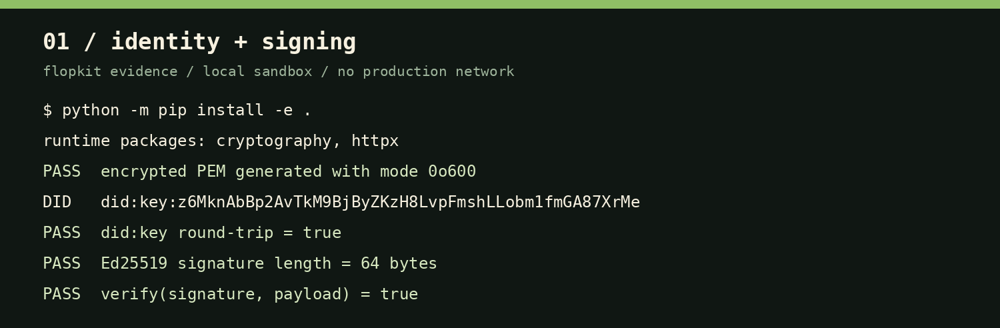
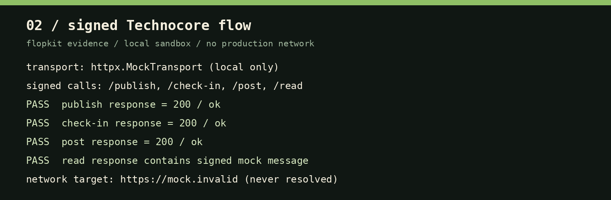
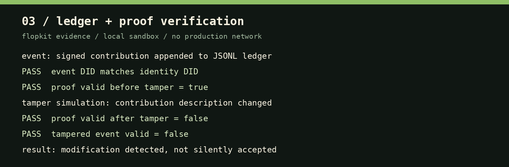

# Performance Evidence

This page records a reproducible execution of the project in a clean Sandbox environment, representing a user who has just installed the SDK. The identity used for this run was created specifically for testing. No passphrase was written to the output, and no live Technocore endpoint was called.

## Execution scenario

The main scenario used Python 3.12, the lightweight runtime installation, and a local `httpx.MockTransport`. The mock implements the signed Technocore request contract: it reads the DID from the request header, decodes the base64 signature, and verifies the canonical request payload with the public key represented by that DID.

```text
clean venv
   ↓
pip install -e .
   ↓
generate encrypted Ed25519 identity
   ↓
sign and verify payload
   ↓
publish → check-in → post → read against local mock
   ↓
append contribution to JSONL ledger
   ↓
export proof → mutate event → export again
```

## Identity and signing



The identity run generated a public DID, completed the `did:key` round trip, created the PEM file with mode `0600`, and verified the generated Ed25519 signature. The page and its evidence output contain no private key or passphrase.

## Signed Technocore flow



The four `/publish`, `/check-in`, `/post`, and `/read` paths completed successfully against the local mock. The `read` response returned the signed mock message. The `https://mock.invalid` URL was a test-only base URL and was never resolved or contacted.

## Ledger and tamper detection



A contribution was appended to the JSONL ledger and exported to a proof file. The proof was valid before modification. The event description was then changed, and the next export reported `valid: false` for the tampered event. This demonstrates that content changes are detected rather than silently accepted.

## CLI smoke test

The main CLI help was executed in the runtime-only environment without installing development tooling:

```text
usage: flopkit [-h]
               {generate-identity,publish,check-in,post,log,export-proof} ...
Secure Technocore SDK CLI
```

A new user can reproduce the basic local setup with:

```bash
python -m venv .venv
. .venv/bin/activate
python -m pip install -e .
flopkit --help
flopkit generate-identity --path identity.pem
```

MCP support is optional and can be installed only when required:

```bash
python -m pip install -e '.[mcp]'
python -m flopkit.mcp_server
```

## Result interpretation

This evidence demonstrates that the core SDK installs and runs in a clean environment, identity and signatures work, the client sends signed requests to a validating local mock, and the ledger detects tampering. It does not prove that live Technocore endpoint paths are correct or that a production service is available. Those claims require manual configuration review against the live Technocore documentation and a controlled test using a dedicated test identity.

## Reproduction

The evidence scenario contains only public test output and test-only data. To reproduce the broader validation suite, install the development extras and run:

```bash
python -m pip install -e '.[dev]'
pytest --cov --cov-fail-under=90
```

The latest full validation completed with **11 passing tests** and **95.20% coverage**. All Technocore tests use local mock transports and do not depend on production network access.
