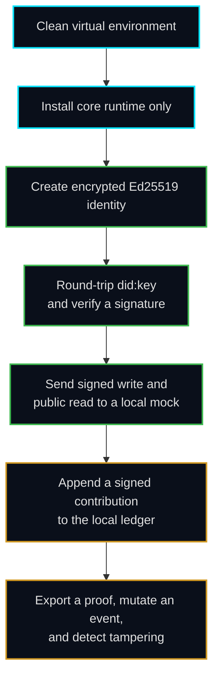

# Performance and validation evidence

This page documents reproducible validation for the SDK-only architecture. It separates automated local evidence from claims that require a deliberate live testnet action. No passphrase, private key, token, or production credential belongs in the evidence files.

## Validated execution flow

The controlled scenario uses Python 3.12, the lightweight runtime installation, and a local `httpx.MockTransport`. The mock validates the Technocore room contract: signed writes use the configured write endpoint, a nonce, and an unpadded base64url Ed25519 signature over the normalized request payload; public reads use the configured read endpoint.



## Identity and signing


The identity scenario produces a public DID, verifies the `did:key` conversion round trip, creates an encrypted PEM file with owner-only permissions where supported, and validates an Ed25519 signature. The evidence output contains no private key or passphrase.

## Signed Technocore flow


The client completes a signed room write and a public room read against a local protocol mock. The mock checks the request signature and returns a deterministic test message. This proves client-side request construction and verification without contacting the live service.

## Ledger and proof tamper detection


A contribution is appended to the JSONL ledger and exported to a proof file. The original proof verifies successfully. After the event description is changed, the next verification reports the event as invalid. Content changes are therefore detected rather than silently accepted.

## Runtime-only CLI smoke test

The CLI help is available after the core installation, without installing the development toolchain:

```text
usage: flopkit [-h]
               {generate-identity,say,post,read,log,export-proof,proof,verify-proof,rooms,note-read,note-write,did-publish,did-resolve}
               ...

Secure Technocore SDK CLI
```

A new user can reproduce the runtime-only smoke test with:

```bash
python -m venv .venv
. .venv/bin/activate
python -m pip install -e .
flopkit --help
flopkit generate-identity --path identity.pem
flopkit rooms
```

MCP is deliberately separate:

```bash
python -m pip install -e '.[mcp]'
python -m flopkit.mcp_server
```

## Full local quality gate

From `sdk/`, install the contributor extra and run:

```bash
python -m pip install -e '.[dev]'
ruff check .
mypy .
pytest --cov --cov-fail-under=90
mkdocs build --strict
```

The exact test count and coverage percentage are generated by the current test run and should be reported from CI output rather than copied as an unverifiable static claim.

## What this evidence proves

The evidence demonstrates that the SDK-only repository can install its core runtime in a clean environment, create and protect an identity, sign and verify data, construct signed client requests against a validating local mock, and detect ledger tampering. It does not prove live endpoint availability, production service behavior, or a user's external network configuration. Those claims require a manual configuration review and a controlled one-time test with a dedicated test identity.
